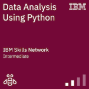

# MY ACHIEVEMENTS 

# 1.IBM Badges

        

## 2.Completed Job simualtion from Forage

##  BRITISH AIRWAYS 
"https://forage-uploads-prod.s3.amazonaws.com/completion-certificates/British%20Airways/NjynCWzGSaWXQCxSX_British%20Airways_3gp7DdzCmoWTNgxQn_1709483967278_completion_certificate.pdf"

## ACCENTURE 
"https://forage-uploads-prod.s3.amazonaws.com/completion-certificates/Accenture%20North%20America/hzmoNKtzvAzXsEqx8_Accenture%20North%20America_3gp7DdzCmoWTNgxQn_1705073789638_completion_certificate.pdf"

## PWC
"https://forage-uploads-prod.s3.amazonaws.com/completion-certificates/PwC%20Switzerland/a87GpgE6tiku7q3gu_PwC%20Switzerland_3gp7DdzCmoWTNgxQn_1706887170876_completion_certificate.pdf"

## TATA 
"https://forage-uploads-prod.s3.amazonaws.com/completion-certificates/Tata/MyXvBcppsW2FkNYCX_Tata_3gp7DdzCmoWTNgxQn_1706608438497_completion_certificate.pdf"

# 3.INTERNSHIPS
<h3 align ="center">Oasis Infobyte Web-development Internship </h3>
<h4 align = left>'APPRECIATION CETIFICATE' https://github.com/user-attachments/files/17900623/Rasika.Kulkarni.Appreciattion-Certificate.pdf</h4>
<h3 align="center">Oasis Infobyte Data Science Internship</h3>
<h4 align =left>'APPRECIATION CERTIFICATE' https://github.com/16rasika/16rasika/blob/main/Rasika%20%20Kulkarni%20Appreciation%20Certificate%20Oasis-Infobyte.pdf
</h4> 

<h3 align="center">Skill-Genie Data Science Internship</h3>
<h4 align= left>'COMPLETION CERTIFICATE' https://github.com/16rasika/16rasika/blob/main/Completion-Rasika%20Kulkarni%20Certificate.pdf</h4> 

<h1 align="center">Hi 👋, I'm Rasika Kulkarni</h1>
<h1 align="Center">I hold a Bachelors Degree in Electronics From India and completed Bootcamp from WBS-Berlin</h1>
<h1 align="Center">After completing bootcamp to get hands-on experience I completed 15+ projects in different area  of Data science. 
   In addition to that 2 remote Internship in Data science area & 1 Internship from Web-development area, not only Internships I have also completed 4 Virtual job simulation from Forage. </h1>
<h1 align="Center">Furthermore, with data visualization tools I developed more than 6 dashboards in Power-BI and Tableau</h1>
<h3 align="center">A passionate Data Scientist</h3>
<h3 align='center'>Like to work with Data visualization tools Like POWER-BI </h3>
<h3 align="center">😄 Pronouns: She</h3>

- <h3 align="center">🤝 fields_of_interests: Data Science,
    Machine Learning, Deep Learning,Power-BI</h3>

- 👨‍💻 All of my projects are available at [github.com/16rasika](github.com/16rasika)

- 📫 How to reach me **www.linkedin.com/in/16rasika/**

<h3 align="left">Connect with me:</h3>

<h3 align="left">Languages and Tools:</h3>

         

# 4.ACHIEVED CERTIFICATIONS & Hands-on-Projects

## 1.Opencv
**OpenCV**:"https://courses.opencv.org/certificates/d603857526d141dcb181a232ec8060c6"

## 2.Python Certification 

**IBM Machine Learning with Python** : "https://courses.cognitiveclass.ai/certificates/9c9b44c598ff4549932d647485013e81"

**IBM Python for Data Science** : 'https://www.credly.com/badges/cf0bab1f-ec93-470e-9dd3-ed799669ecdf/public_url'

**Udemy Python Flask** : https://www.udemy.com/course/python-flask-for-beginners/learn/lecture/8294590?start=240#overview

## 3.SQL Certifification & Projects

https://github.com/16rasika/SQL-Skillbuilder

**Simplilearn Introduction to SQL** : "https://certificates.simplicdn.net/share/4974439_1711038948.pdf"

**Simplilearn PostgreSQL** :"https://certificates.simplicdn.net/share/4976353_1711103255.pdf"

## 4.Data Visualization Certification & Projects

https://github.com/16rasika/Data-Science-Skill-builder/tree/main/Data%20Visualization/Power-BI

https://github.com/16rasika/Cognify-Tech-Power-BI-internship

https://github.com/16rasika/Data-Science-Skill-builder/tree/main/Data%20Visualization/Tableau

**Simplilearn Tableu Training** :"https://certificates.simplicdn.net/share/4648475_1700063318.pdf"

**Great Leraning Power-BI**: "https://olympus.mygreatlearning.com/courses/30824/certificate"

**Udemy-Power-BI** : https://www.udemy.com/course/microsoft-power-bi-course-for-beginners-practical-course/learn/lecture/26892878#overview

**Simplilearn Power-BI**:"https://certificates.simplicdn.net/share/7349618_1725487328.pdf"

**Maven Analytics** : "https://mavenanalytics.io/crash-courses/go-from-data-to-dashboard-in-15-minutes-in-power-bi"

## 5.GIT

**Simplilearn GIT** :https://lms.simplilearn.com/courses/2823/GIT/certificate/download-skillup

## 6.Cloud Computing

**Udemy** :https://www.udemy.com/share/101tKA3@IyG-L7PiR0bFDUNzSsKCoPw4_P-oBln7HvuGotAQozXnfdF3tx_1_aqzW_6bjxgQJw==/

## 7.Machine learning 

**IBM**:https://courses.cognitiveclass.ai/certificates/19e1d67a475c4bb6a1320e51c11c14d8#

https://github.com/16rasika/Data-Science-Skill-builder

https://github.com/16rasika/Forage-Portfolio

https://github.com/16rasika/OIBSIP-Data-Science-

https://github.com/16rasika/Skill-Genie-Internship

https://github.com/16rasika/Heart_Diseases

https://github.com/16rasika/DataScience-Portfolio

## 8.Big-Data
**Udemy**:https://www.udemy.com/course/big-data-and-hadoop-essentials-free-tutorial/learn/lecture/1243166#overview

**AWS**:AWS_Hadoop_Fundamentals

**Udemy**:https://www.udemy.com/course/big-data-foundation-for-engineers-scientists-analysts/learn/lecture/45661449#overview (Data Engineering Foundation: Spark/Hadoop/Kafka/MongoDB)

## Pytorch PROJECTS

https://github.com/16rasika/Pytorch-skillbuilder

 
