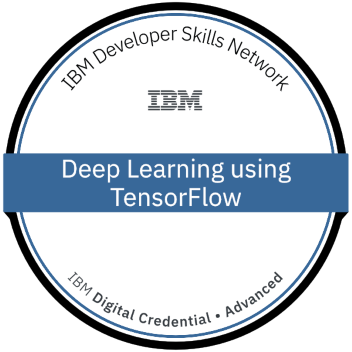

<h1 align="center">Hi 👋, I'm Rasika Kulkarni</h1>
<h1 align="Center">I hold a Bachelors Degree in Electronics From India and completed Bootcamp from WBS-Berlin</h1>
<h1 align="Center">After completing bootcamp completed 15+ projects in multiple fields like SQL,ML,DL,Data analysis</h1>
<h1 align="Center">Furthermore, In data visualization developed 6 dashboard in Power-BI and 3 in Tableau</h1>
<h3 align="center">A passionate Data Scientist</h3>
<h3 align="center">😄 Pronouns: She</h3>

- <h3 align="center">🤝 fields_of_interests:** "Data Science",
    "Machine Learning",
   "Deep Learning"</h3>

- 👨‍💻 All of my projects are available at [github.com/16rasika](github.com/16rasika)

- 📫 How to reach me **www.linkedin.com/in/16rasika/**

<h3 align="left">Connect with me:</h3>

<h3 align="left">Languages and Tools:</h3>

         

# Badges

   

## Achievements 

IBM Machine Learning with Python : "https://courses.cognitiveclass.ai/certificates/9c9b44c598ff4549932d647485013e81"

Simplilearn Introduction to SQL : "https://certificates.simplicdn.net/share/4974439_1711038948.pdf"

Simplilearn Tableu Training :"https://certificates.simplicdn.net/share/4648475_1700063318.pdf"

Simplilearn PostgreSQL :"https://certificates.simplicdn.net/share/4976353_1711103255.pdf"

# Internships
<h3 align="left">Skill Genie Data Science Internship</h3>
<h4 align= left>Completion Certificate</h4> 

<h3 align="left">Oasis InfoByte Data Science Internship</h3>
<h4 align =left>'STAR PERFORMANCE APPRECIATION CERTIFICATE'</h4> 

## Virtual Internship

"https://forage-uploads-prod.s3.amazonaws.com/completion-certificates/British%20Airways/NjynCWzGSaWXQCxSX_British%20Airways_3gp7DdzCmoWTNgxQn_1709483967278_completion_certificate.pdf"

"https://forage-uploads-prod.s3.amazonaws.com/completion-certificates/Accenture%20North%20America/hzmoNKtzvAzXsEqx8_Accenture%20North%20America_3gp7DdzCmoWTNgxQn_1705073789638_completion_certificate.pdf"

"https://forage-uploads-prod.s3.amazonaws.com/completion-certificates/PwC%20Switzerland/a87GpgE6tiku7q3gu_PwC%20Switzerland_3gp7DdzCmoWTNgxQn_1706887170876_completion_certificate.pdf"

"https://forage-uploads-prod.s3.amazonaws.com/completion-certificates/Tata/MyXvBcppsW2FkNYCX_Tata_3gp7DdzCmoWTNgxQn_1706608438497_completion_certificate.pdf"

## ML & DL Models used in Hands-on-projects
I've used different Machine Learning and Deep Learning models in hands-on-projects. Below are some used models:

1.Linear Regression

2.Logistic Regression

3.Support Vector Machines (SVM)

4.Decision Trees (DT)

5.Random Forests (RF)

6.K-Nearest Neighbors (KNN)

7.Deep Neural Networks

8.Convolutional Neural Networks (CNN)

9.Recurrent Neural Networks (RNN)

10.Naive Bayes (NB)

11.Gradient Boosted Decision Trees (GBDT)

12.XGBoost

## Remote Interships

1.Skill-Genie

2.Oasis Infobyte
 
